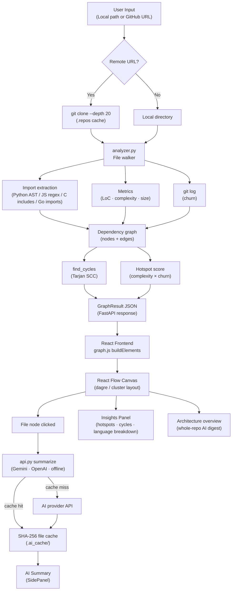

# Repository Structure Analysis and Visualization System

This project is a developer onboarding tool that analyzes a local or GitHub
repository and turns it into an interactive architecture map. It helps answer:

- What files and folders exist in this codebase?
- Which files depend on each other?
- Which files are large, complex, frequently changed, or highly coupled?
- What does a selected file do, in simple language?

Unlike a normal file explorer, this system combines static dependency analysis,
code metrics, graph visualization, and AI summaries in one workflow. It is useful
for onboarding to unfamiliar repositories, finding risky files before refactoring,
and explaining project structure during reviews or demos.

## Key Features

- **Repository input**: analyze an absolute local path or a GitHub URL such as
  `owner/repo` or `https://github.com/user/repo`.
- **Static dependency detection**: extracts internal dependencies without running
  user code.
- **Supported languages**: Python, JavaScript, TypeScript, C/C++, Go, Java,
  Ruby, and Rust file detection. Dependency extraction is implemented for Python,
  JavaScript/TypeScript, C/C++, and Go.
- **Interactive graph**: React Flow canvas with zoom, pan, draggable nodes,
  minimap, curved dependency edges, and PNG export.
- **Folder grouping**: sparse repositories are grouped visually by folder so the
  graph remains readable even when only a few files import each other.
- **Large repo handling**: large graphs use a fast clustered layout and file caps
  to keep the browser responsive.
- **Metrics per file**: lines of code, total lines, estimated complexity, file
  size, fan-in, fan-out, git churn, and hotspot score.
- **Repository insights**: most depended-on files, most complex files, risk
  hotspots, language breakdown, and circular dependency report.
- **AI file summary**: clicking a file can summarize its purpose using Gemini or
  OpenAI. If no API key is configured, the app still works with an offline
  heuristic summary.
- **AI caching**: summaries are cached by file content hash so unchanged files
  are not re-analyzed.
- **Architecture overview**: generates a short AI overview of the whole
  repository from graph-level metrics and dependency data.

## Tech Stack

| Layer | Technology |
| --- | --- |
| Backend | Python, FastAPI, Pydantic, Uvicorn |
| Analysis | Python `ast`, regex import parsing, git CLI |
| Frontend | React, Vite, React Flow |
| Layout | Dagre for small dense graphs, custom clustered layout for sparse/large graphs |
| AI | Google Gemini or OpenAI API with offline fallback |

## System Architecture



## Project Structure

```text
project_gdsc/
|-- backend/
|   |-- main.py            # FastAPI app and REST endpoints
|   |-- analyzer.py        # Traversal, dependency parsing, metrics, cycles
|   |-- ai.py              # AI summaries and content-hash cache
|   |-- requirements.txt
|   |-- .env.example       # Optional AI provider configuration
|-- frontend/
|   |-- src/
|   |   |-- App.jsx
|   |   |-- api.js
|   |   |-- graph.js
|   |   |-- components/
|   |   |   |-- FileNode.jsx
|   |   |   |-- FolderGroup.jsx
|   |   |   |-- InsightsPanel.jsx
|   |   |   |-- SidePanel.jsx
|   |-- package.json
|   |-- vite.config.js
|-- start-backend.bat
|-- start-frontend.bat
```

## Setup and Run Instructions

### Prerequisites

- Python 3.10 or newer
- Node.js 18 or newer
- Git installed and available in the terminal
- Optional: Gemini or OpenAI API key for real AI summaries

### 1. Run the Backend

```bash
cd backend
python -m pip install -r requirements.txt
python -m uvicorn main:app --reload --host 127.0.0.1 --port 8000
```

Backend URL:

```text
http://127.0.0.1:8000
```

API docs:

```text
http://127.0.0.1:8000/docs
```

On Windows, you can also run:

```bash
start-backend.bat
```

### 2. Optional AI Configuration

Copy the example environment file:

```bash
cd backend
copy .env.example .env
```

Then edit `.env`:

```env
AI_PROVIDER=auto
GEMINI_API_KEY=
OPENAI_API_KEY=
GEMINI_MODEL=gemini-2.0-flash
OPENAI_MODEL=gpt-4o-mini
```

If no API key is provided, the app still works and returns offline heuristic
summaries.

### 3. Run the Frontend

```bash
cd frontend
npm install
npm run dev
```

Frontend URL:

```text
http://127.0.0.1:5173
```

On Windows, you can also run:

```bash
start-frontend.bat
```

### 4. Build for Production

```bash
cd frontend
npm run build
```

This verifies that the React app compiles successfully.

## Testing Workflow

1. Start the backend on `http://127.0.0.1:8000`.
2. Start the frontend on `http://127.0.0.1:5173`.
3. Open the frontend in the browser.
4. Enter a local path or GitHub URL, for example:

```text
https://github.com/Lakshya44444/DrishtiAI
```

or:

```text
https://github.com/rootp1/koordinator
```

5. Click **Analyze**.
6. Inspect the graph, folder groups, dependency edges, insights panel, and side
   panel.
7. Click a file node to view metrics, dependencies, source code, and AI summary.
8. Open `http://127.0.0.1:8000/docs` to test backend endpoints directly.

## API Endpoints

| Method | Endpoint | Purpose |
| --- | --- | --- |
| `GET` | `/api/health` | Check backend status and active AI provider |
| `POST` | `/api/analyze` | Analyze a local path or GitHub repo and return graph JSON |
| `GET` | `/api/file` | Return source text for a selected analyzed file |
| `POST` | `/api/summarize` | Summarize a selected file with AI/cache/offline fallback |
| `POST` | `/api/architecture` | Generate a repository-level architecture overview |

Example `/api/analyze` request:

```json
{
  "path": "https://github.com/Lakshya44444/DrishtiAI",
  "max_files": 900
}
```

The backend returns:

- `nodes`: files with metrics
- `edges`: internal dependency links
- `stats`: repository-level totals
- `cycles`: circular dependency groups
- `insights`: hotspots, language breakdown, and ranking data

## How It Works

### Static Analysis

The backend walks the repository and only reads supported source files. It does
not execute repository code. This keeps analysis safer and makes the system
suitable for unknown projects.

Dependency parsing:

- Python: `ast` parser with regex fallback
- JavaScript/TypeScript: `import`, `require`, and `export ... from`
- C/C++: `#include`
- Go: `import` and `go.mod` module resolution

External package imports are ignored because the graph focuses on internal file
relationships.

### Metrics

- **LoC**: non-empty, non-comment lines
- **Complexity**: lightweight cyclomatic estimate based on branch keywords
- **Fan-in**: how many internal files import this file
- **Fan-out**: how many internal files this file imports
- **Git churn**: how often a file changed in git history
- **Hotspot**: normalized complexity multiplied by normalized churn

### Visualization

Small dense graphs use Dagre layout. Sparse or large repositories use a folder
cluster layout, which prevents the graph from becoming a tiny straight line and
keeps repositories readable during demos.

Large repositories are capped for performance:

- Frontend default request: `900` source files
- Backend hard cap: `1500` source files

When analysis is truncated, the insights panel shows a note.

### AI Summaries

When a file is selected, the backend reads the file content and sends it to the
configured AI provider with dependency context. The summary is cached using a
SHA-256 hash of the file content, context, provider, and model.

If the file changes, the hash changes and a new summary is generated.

## Assumptions and Limitations

- The project performs static analysis only; it does not run the target code.
- Dynamic imports, reflection, generated code, and framework-specific dependency
  injection may not be fully detected.
- External dependencies such as `react`, `numpy`, or `fastapi` are intentionally
  skipped so the graph focuses on internal architecture.
- Very large repositories are capped to avoid freezing the browser.
- Git churn requires the analyzed directory to contain git history.
- AI summaries require an internet connection and API key, but offline fallback
  keeps the app usable without them.

## Additional Features for Verification

These features go beyond the minimum project statement and can help during
evaluation:

- GitHub URL analysis with shallow clone and local clone cache.
- Content-hash AI cache to reduce API cost.
- Offline summary fallback for demos without API keys.
- Circular dependency detection using Tarjan's strongly connected components.
- Hotspot ranking using complexity and git churn.
- Coupling metrics using fan-in and fan-out.
- Folder grouping for sparse repositories.
- Large-repo performance safeguards.
- Syntax-highlighted source preview.
- Search, language filter, LoC filter, and cycle-only filter.
- PNG export of the graph.
- FastAPI Swagger docs for easy endpoint testing.

## Security Notes

- The backend only serves files from repositories analyzed in the current
  session.
- File reads are checked to prevent path escape outside the analyzed root.
- CORS is open for local development. Restrict `allow_origins` before deploying
  outside a local/demo environment.

## Suggested Demo Repositories

```text
https://github.com/Lakshya44444/DrishtiAI
https://github.com/rootp1/koordinator
```

DrishtiAI is useful for showing folder grouping and AI summaries. Koordinator is
useful for showing large-repository performance handling.
