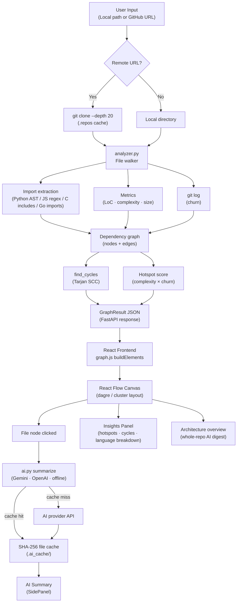

# Repository Structure Analysis and Visualization System

A full-stack developer tool that analyzes any local or GitHub repository and renders it as an **interactive dependency graph** — complete with code metrics, circular dependency detection, hotspot ranking, and AI-generated file and architecture summaries.

Unlike static file explorers or simple dependency scanners, this system combines **static analysis + graph visualization + AI explanation** in a single workflow, making it practical for onboarding, code review, and pre-refactoring audits.

---

## Features

### Core Analysis
- **Multi-language dependency extraction** — Python (`ast` + regex fallback), JavaScript/TypeScript (`import` / `require` / `export from`), C/C++ (`#include`), Go (`import` + `go.mod` module resolution)
- **Code metrics per file** — lines of code, total lines, estimated cyclomatic complexity, file size, fan-in, fan-out
- **Git churn** — counts how often each file changed across git history (up to 4000 commits)
- **Hotspot score** — normalized `complexity × churn`; files that are both complex and frequently changed rank highest
- **Circular dependency detection** — Tarjan's strongly connected components algorithm, iterative implementation to avoid recursion limits on large graphs

### Visualization
- **Interactive React Flow canvas** — zoom, pan, drag nodes, minimap, curved animated edges
- **Color modes** — language-based coloring, hotspot heat map (green→red), complexity heat map
- **Folder grouping** — sparse or large repos are automatically clustered by folder so the graph stays readable
- **Large repo handling** — dagre layout for small dense graphs; custom grid cluster layout for sparse/large graphs; file cap with user notification
- **PNG export** — one-click canvas snapshot

### Insights Panel
- Repository-level stats (files, edges, LoC, cycle count)
- Top risk hotspots ranked by complexity × churn
- Most depended-on files (highest fan-in)
- Most complex files
- Language breakdown
- Circular dependency groups with clickable file chips

### AI Summaries
- **Per-file explanation** — clicking a node requests a 3-sentence plain-language summary from the AI provider, with import/export context injected into the prompt
- **Architecture overview** — whole-repo narrative generated from a graph digest (file count, dependency sample, hotspot list, language breakdown)
- **Content-hash cache** — summaries are stored by SHA-256 hash of `(file content + context + provider + model)`; unchanged files are never re-analyzed
- **Graceful offline fallback** — if no API key is set, a deterministic heuristic summary is generated locally so the app remains fully usable without internet

### Other
- **GitHub URL support** — enter `owner/repo` or a full HTTPS URL; the backend shallow-clones with `--depth 20` and caches the clone
- **Source code viewer** — syntax-highlighted file preview with copy button inside the side panel
- **Search + filters** — filename search, language filter chips, LoC range slider, cycle-only toggle
- **Configurable backend URL** — gear icon lets you point the frontend at any backend host at runtime

---

## Tech Stack

| Layer | Technology |
|---|---|
| Backend | Python 3.10+ · FastAPI · Pydantic · Uvicorn |
| Analysis | Python `ast` · regex · subprocess `git` CLI |
| Frontend | React 18 · Vite · React Flow · Dagre |
| Styling | Vanilla CSS |
| AI | Google Gemini API · OpenAI API · offline heuristic fallback |

---

## System Architecture



---

## Project Structure

```
project_gdsc/
├── backend/
│   ├── main.py          # FastAPI app — REST endpoints, git clone, file serving
│   ├── analyzer.py      # File walker, import parsing, metrics, Tarjan SCC, churn
│   ├── ai.py            # AI summarization with SHA-256 content-hash cache
│   ├── requirements.txt
│   └── .env.example     # AI provider configuration template
├── frontend/
│   └── src/
│       ├── App.jsx              # Main canvas, state, toolbar, filters
│       ├── api.js               # Fetch wrappers for all backend endpoints
│       ├── graph.js             # dagre layout, cluster layout, color modes, digest builder
│       ├── styles.css
│       └── components/
│           ├── FileNode.jsx     # Custom React Flow node
│           ├── FolderGroup.jsx  # Folder container node
│           ├── InsightsPanel.jsx
│           └── SidePanel.jsx    # Metrics, deps, AI summary, source viewer
├── start-backend.bat
└── start-frontend.bat
```

---

## Setup and Run Instructions

### Prerequisites

| Requirement | Version |
|---|---|
| Python | 3.10 or newer |
| Node.js | 18 or newer |
| Git | any recent version, available in PATH |

---

### Step 1 — Backend

```bash
cd backend
pip install -r requirements.txt
python -m uvicorn main:app --reload --port 8000
```

Verify it's running:
```
http://127.0.0.1:8000/docs    ← Swagger UI for all endpoints
http://127.0.0.1:8000/api/health
```

> **Windows shortcut:** double-click `start-backend.bat` from the project root.

---

### Step 2 — AI Configuration (optional but recommended)

```bash
cd backend
copy .env.example .env
```

Edit `.env` and add one key:

```env
# Option A — Google Gemini (recommended, free tier available)
GEMINI_API_KEY=your_gemini_key_here

# Option B — OpenAI
OPENAI_API_KEY=your_openai_key_here

# Model overrides (optional)
GEMINI_MODEL=gemini-2.0-flash
OPENAI_MODEL=gpt-4o-mini
```

**Without any key:** the app still runs fully — file summaries and architecture overviews fall back to a deterministic offline heuristic. No features are broken.

---

### Step 3 — Frontend

```bash
cd frontend
npm install
npm run dev
```

Open: `http://127.0.0.1:5173`

> **Windows shortcut:** double-click `start-frontend.bat` from the project root.

---

### Step 4 — Analyze a Repository

1. Enter a **local path** (e.g. `C:\code\my-project`) or a **GitHub URL** (e.g. `owner/repo` or `https://github.com/owner/repo`)
2. Click **Analyze**
3. Explore the graph — click any node to open its side panel with metrics, dependencies, and AI summary
4. Click **Generate AI overview** in the Insights panel for a whole-repo narrative

---

## API Reference

| Method | Endpoint | Body | Description |
|---|---|---|---|
| `GET` | `/api/health` | — | Backend status and active AI provider |
| `POST` | `/api/analyze` | `{ path, max_files }` | Analyze a local path or GitHub URL; returns full graph JSON |
| `GET` | `/api/file` | `?root=&path=` | Return raw source of a file within an analyzed root |
| `POST` | `/api/summarize` | `{ root, path, force, imports, imported_by }` | AI summary for a selected file |
| `POST` | `/api/architecture` | `{ root, digest, force }` | Whole-repo architecture overview from a graph digest |

Example request to `/api/analyze`:
```json
{
  "path": "https://github.com/Lakshya44444/DrishtiAI",
  "max_files": 900
}
```

---

## Recommended Test Repositories

| Repository | What it demonstrates |
|---|---|
| `https://github.com/Lakshya44444/DrishtiAI` | Folder grouping, AI summaries, mixed Python + JS |
| `https://github.com/rootp1/koordinator` | Large-repo performance, Go module resolution, hotspot ranking |
| Any local project on your machine | Fastest analysis, full git churn data |

---

## Assumptions and Additional Features

### Assumptions
- **Static analysis only** — the tool never executes repository code; it reads source text and parses imports with `ast` or regex. This makes it safe for unknown projects.
- **Internal dependencies only** — external packages (`react`, `numpy`, `fastapi`, etc.) are intentionally excluded. The graph focuses on the internal architecture of the project.
- **Git churn requires git history** — if the analyzed directory has no `.git` folder, churn is 0 for all files and hotspot is computed from complexity alone.
- **Language support scope** — import extraction is implemented for Python, JavaScript, TypeScript, C/C++, and Go. Java, Ruby, and Rust files appear as nodes but their imports are not parsed.

### Additional Features (beyond the base requirement)

| Feature | Details |
|---|---|
| **GitHub URL analysis** | Supports `owner/repo` shorthand, full HTTPS URLs, and SSH URLs. Clone is cached so repeated analysis of the same repo is instant. |
| **Content-hash AI cache** | Cache key = SHA-256 of `(file content + dependency context + provider + model)`. Summaries are invalidated only when the file actually changes. |
| **Offline AI fallback** | Deterministic heuristic summary extracts docstrings, leading comments, and line/definition counts — no API key required. |
| **Tarjan SCC cycle detection** | Iterative implementation avoids Python's recursion limit on repos with thousands of files. Cycle members are flagged on every affected node and edge. |
| **Hotspot ranking** | Normalized `complexity × churn` combines static and dynamic signals. Useful for prioritizing technical debt. |
| **Fan-in / fan-out coupling** | Identifies highly coupled files (many dependents = fragile to change; many imports = hard to isolate). |
| **Dual layout engine** | Dagre hierarchical layout for small dense graphs; custom folder-cluster grid layout for sparse or large repos — prevents degenerate straight-line graphs. |
| **Resizable side panel** | Drag handle between canvas and panel to resize at runtime. |
| **Syntax-highlighted source** | File content fetched from backend and rendered with Prism syntax highlighting inside the side panel. |
| **PNG export** | Temporarily hides overlay UI elements, renders the canvas to a full-resolution PNG, then restores the UI. |
| **Abort / cancel** | Long-running analyze requests (especially remote clones) can be cancelled mid-flight via `AbortController`. |
| **FastAPI Swagger docs** | All endpoints are fully documented at `/docs` for easy manual testing. |

---

## Security Notes

- Files are only served from repositories analyzed in the current session — the backend tracks analyzed roots and rejects any path outside them.
- Path traversal is blocked: every file request is resolved and checked to be within the analyzed root before reading.
- CORS is open (`*`) for local development. Set a specific origin in `main.py` before any public deployment.
