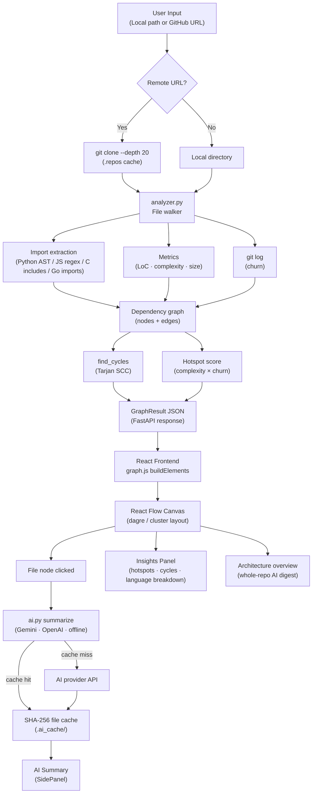

# Repository Structure Analysis and Visualization System

An interactive developer tool that turns any local or GitHub repository into a live architecture map — with dependency graphs, code metrics, circular dependency detection, and AI-powered file summaries.

## Features

- **Dependency graph** — visualizes internal import relationships as a directed graph
- **Code metrics** — LoC, cyclomatic complexity, fan-in/fan-out, file size per node
- **Hotspot detection** — ranks files by complexity × git churn
- **Circular dependency detection** — Tarjan's SCC algorithm, highlighted on the graph
- **AI summaries** — per-file explanations via Gemini or OpenAI, with offline fallback
- **Architecture overview** — whole-repo AI narrative generated from graph metrics
- **GitHub URL support** — shallow-clones remote repos on the fly
- **Filters** — search, language filter, LoC slider, cycle-only view, PNG export

## Tech Stack

| Layer | Technology |
|---|---|
| Backend | Python · FastAPI · Uvicorn |
| Analysis | `ast` · regex · git CLI |
| Frontend | React · Vite · React Flow |
| Layout | Dagre (dense) · custom cluster (sparse/large) |
| AI | Google Gemini · OpenAI · offline heuristic fallback |

## System Architecture



## Project Structure

```
project_gdsc/
├── backend/
│   ├── main.py          # FastAPI app and REST endpoints
│   ├── analyzer.py      # File walker, dependency parsing, metrics, cycles
│   ├── ai.py            # AI summaries with content-hash cache
│   ├── requirements.txt
│   └── .env.example
└── frontend/
    └── src/
        ├── App.jsx
        ├── api.js
        ├── graph.js
        └── components/
            ├── FileNode.jsx
            ├── InsightsPanel.jsx
            └── SidePanel.jsx
```

## Setup

### Prerequisites
- Python 3.10+
- Node.js 18+
- Git

### Backend

```bash
cd backend
pip install -r requirements.txt
python -m uvicorn main:app --reload --port 8000
```

### AI Configuration (optional)

```bash
copy .env.example .env   # Windows
```

Edit `.env`:

```env
GEMINI_API_KEY=your_key_here
# or
OPENAI_API_KEY=your_key_here
```

Without a key the app still works using offline heuristic summaries.

### Frontend

```bash
cd frontend
npm install
npm run dev
```

Frontend: `http://127.0.0.1:5173` · Backend: `http://127.0.0.1:8000`

> On Windows you can use `start-backend.bat` and `start-frontend.bat` instead.

## API

| Method | Endpoint | Description |
|---|---|---|
| `GET` | `/api/health` | Backend status and active AI provider |
| `POST` | `/api/analyze` | Analyze a local path or GitHub repo |
| `GET` | `/api/file` | Return source of an analyzed file |
| `POST` | `/api/summarize` | AI summary for a selected file |
| `POST` | `/api/architecture` | Whole-repo architecture overview |

## Demo Repositories

```
https://github.com/Lakshya44444/DrishtiAI      # folder grouping + AI summaries
https://github.com/rootp1/koordinator           # large-repo performance
```

## Security

- Files are only served from repositories analyzed in the current session.
- Path traversal outside the analyzed root is blocked server-side.
- CORS is open for local development — restrict `allow_origins` before deploying.
